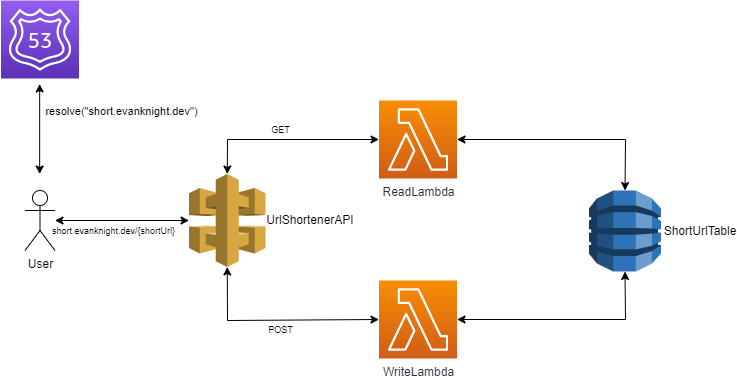

# URL Shortener
Demo at: [short.evanknight.dev](https://short.evanknight.dev/)

This is a simple URL Shortener application. It is entirely serverless, REST-ish, and is written using AWS CDK.

This project was originally split up into separate packages and stored in a private repository; this repo merges
the packages into a [monorepo](https://en.wikipedia.org/wiki/Monorepo) and has been lightly sanitised for public
viewing. Some improvements have also been made since its original creation.

## How It Works


The user flow is as follows:
1. User visits [short.evanknight.dev](https://short.evanknight.dev/)
2. User enters a URL to shorten.
3. Site provides a short URL that redirects to the long URL when accessed.

This flow is broken down into two different functions:
1. Creating a short URL.
2. Reading a short URL.

### Creating a short URL


1. ApiGateway endpoint is called with POST method with the URL to convert in the body of the request.
2. ApiGateway passes request to WriteLambda.
3. WriteLambda hashes the request URL using MD5, converts the hash to alphanumeric characters using base conversion, 
and then shortens the resulting string to the desired length.
4. The DynamoDB table is then queried to check if the created short URL already exists.
   1. If so, the mapped URL in the table is checked to see if it is the same as the request URL.
      1. If the URLs match, then the short URL is returned.
      2. If they do not match, a static string is appended to the request URL and step 4 is repeated.
   2. If not, the short URL and the request URL is written to the table and the short URL is returned.

### Reading a short URL


1. ApiGateway endpoint is called with GET method with the shortUrl set as the path.
2. ApiGateway passes request to ReadLambda.
3. ReadLambda first checks if the path is empty. If so, the user is requesting the home page and the index HTML is returned.
4. If the path is not empty, the DynamoDB table is queried with the short URL.
5. If the table contains the short URL, ReadLambda redirects the user to the long URL. If it does not contain the URL, 
ReadLambda returns a 404 page.

## Design Notes
### API
An OpenAPI spec can be found [here](./design/url_shortener_api.yaml). Note that this spec is for documentation purposes
and is not used in the client or server implementation. That is, no guarantee is made that plugging this into a
code generator will output a working client.

The REST-ish API for this is fairly straightforward; it is just a GET and POST for a shortUrl resource. For GET,
the short URL parameter will be in the path (i.e. short.evanknight.dev/{shortUrl}) and, for POST, the long URL
request will be in the body in JSON format (e.g. {"longUrl": "[https://example.com/](https://example.com/)"}). 
The response for the POST operation will be given in the body of the response in JSON format (i.e. "shortUrl": "{shortUrl}"). 
Certain error cases are handled as well; please see the spec above or read the implementation for more details.

### Database
DynamoDB was used as the database for this application.
* The primary key is the short URL.
* As this is a demo application, a TTL of a few minutes was also used to keep the database small.

The schema is as follows:
```yaml
shortUrl: string
longUrl: string
ttl: number
```

## Implementation Notes
### Lambda SnapStart
The new Lambda feature, [SnapStart](https://docs.aws.amazon.com/lambda/latest/dg/snapstart.html), is used to reduce 
Lambda cold-start time. This works by taking a snapshot of the Lambda after initialization and using the created 
snapshot on a cold-start instead of doing the initialization all over again. Therefore, on startup, the JVM will 
already be initialized and the DynamoDB connection will 
[*likely*](https://docs.aws.amazon.com/lambda/latest/dg/snapstart-best-practices.html#snapstart-networking) still be valid.

There was one small change made to the Lambda code in order to support this: a static, dummy call to DynamoDB is made 
in order to initialize the connection. This is done because SnapStart creates the snapshot after the static 
initialization of the RequestHandler class, so, in order for the DynamoDB connection to be contained in the snapshot, 
we must make a dummy call in the static initialization of the class.

This greatly improved the cold-start time. Before, the average cold-start time averaged around 5000ms. After adding
SnapStart, the cold-start time averages around 500ms (a 90% reduction)!

### Route 53 (DNS)
A pre-existing hosted zone (evanknight.dev) was used. This means that, in the CDK implementation, this resource
was imported instead of created.

### HTML Serving
HTML serving is done directly from the ReadLambda function. It reads the HTML on startup and stores it in memory so that
it can be served when needed. Since the HTML is small, it doesn't really have an impact on the memory footprint of
the lambda. However, it would be ideal to eventually move this to a CDN (see Future Improvements section below).

## How to deploy
### Prerequisites
1. Set up [AWS CLI](https://docs.aws.amazon.com/cli/latest/userguide/getting-started-install.html) 
and [AWS CDK](https://docs.aws.amazon.com/cdk/v2/guide/getting_started.html#getting_started_prerequisites) on your machine.
2. Configure AWS CLI to deploy to the desired account.
3. [Optional] If you want to use Route 53 and make this publicly accessible:
   1. Change evanknight.dev references to desired URL.

### Deployment
```bash
cd infrastructure
cdk deploy
```

## Future Improvements
1. CI/CD
   1. Move deployment process to pipeline.
   2. Add Test stage.
   3. Add integration tests.
2. Move static resources to CDN.
